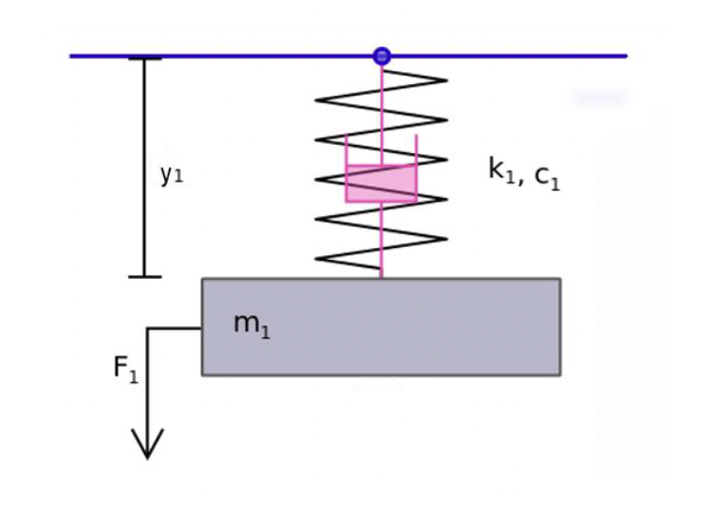
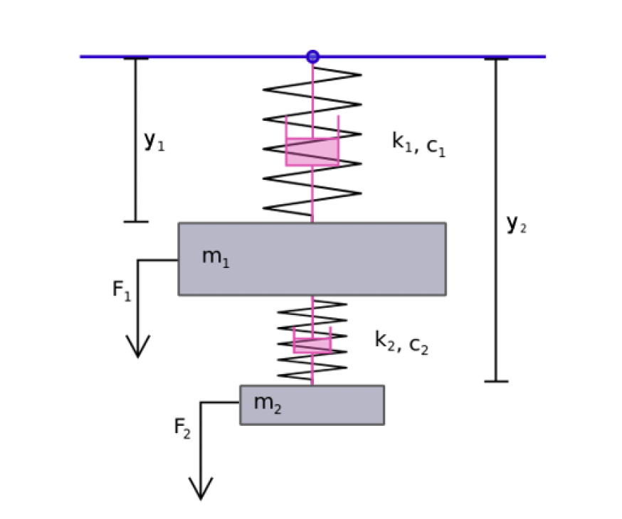
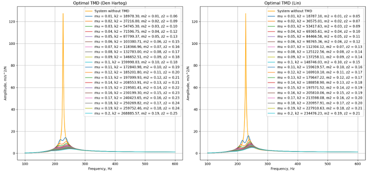
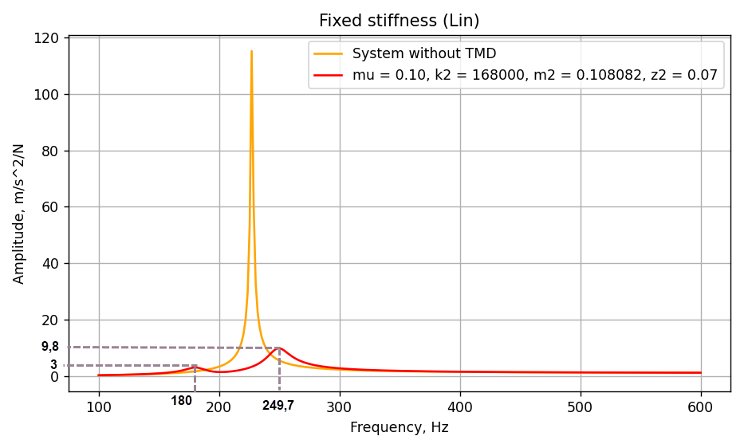

# 📘 TMD Analytical Model (Python)

> Analytical model developed for Master's thesis on Tuned Mass Dampers (TMD) — Hochschule Furtwangen University (HFU), 2025

---

## 🧠 Overview
This repository contains the complete Python implementation of the analytical model described in:

📄 **[Anna Keller – Master Thesis (PDF)](./AnnaKeller_MasterThesis_HFU_signed.pdf)**

The model investigates frequency response of a 2DOF mechanical system with a TMD, analyzing optimal parameters for damping.

---

## 🔬 Model Summary

### Goal

Design and optimize a TMD system for a vibrating medical device by:

- Calculating **optimal mass ratio (μ)** and **damping ratio (ζ)**
- Comparing effects of different TMD configurations on system stability
- Visualizing FRF (Frequency Response Function)

### Analytical Foundation

The primary system is modeled as a **1DOF system** and extended to a **2DOF system** when a TMD is attached. This is reflected in the governing equations and FRF formulations.

#### 📊 1DOF and 2DOF Systems

| System Type | Diagram |
|-------------|---------|
| 1DOF System |  |
| 2DOF with TMD |  |


---

## 📂 Structure

## 📂 Repository Structure


```bash
├── README.md                         # Project description
├── requirements.txt                  # Python dependencies
├── figures/                          # Simulation output figures
│   ├── fixed_k2.png
│   └── den_hartog_vs_lin.png         # Comparison plot (Den Hartog vs Lin)
├── MasterThesis/
│   └── AnnaKeller_MasterThesis_HFU_signed.pdf
├── Thesis.Py/                        # Python source code
│   ├── main.py
│   ├── frf.py
│   ├── optimal_TMD.py
│   ├── primeSystem.py
│   └── solver.py

---

## 🧪 Files Explained

| File              | Description                                                                 |
|-------------------|-----------------------------------------------------------------------------|
| `main.py`         | Main simulation script. Plots multiple FRFs using various TMD configs.                      |
| `solver.py`       | Solver logic for Lin equations                                                              |
| `optimal_TMD.py`  | Calculates optimal TMD parameters using Den Hartog, Lin methods                             |
| `primeSystem.py`  | Act as a config file for input parameters of the primary system (mass, stiffness, damping)  |      
| `frf.py`          | Contains functions for calculating Frequency Response Functions                             |

---

## 📐 Example Formulae

**Undamped 1DOF System:**
\[
H(\omega) = \frac{-\omega^2}{-m\omega^2 + j\omega c + k}
\]

**Tuned with TMD (2DOF):**
\[
H_{tuned}(\omega) = \frac{-\omega^2}{-m_1\omega^2 + j\omega(c_1 + c_2) + k_1 + k_2 - \frac{(j\omega c_2 + k_2)^2}{-m_2 \omega^2 + j\omega c_2 + k_2}}
\]

---

## 🚀 Run the Model

1. Install dependencies (`numpy`, `matplotlib`, `scipy` and `math`)
```bash 
pip install requirements.txt
```
OR

```bash
pip install numpy matplotlib scipy math
```

2. Change the default input parameters in `primeSystem.py`

3. Use any Python environment (Python 3.9+ recommended) to run `main.py`:

```bash
cd Thesis.Py
python3 main.py
```

---

## 📈 Output

The script generates the following results:

- **Frequency Response of the Primary System (Untuned):**  
  Shows the baseline dynamic behavior without any vibration absorber.

- **Tuned System Responses Using:**
  - **Den Hartog Method:** for a range of mass ratios \( \mu \)
  - **Lin Method:** for the same range of \( \mu \)
  - **Fixed Stiffness \( k_2 \):** using both Den Hartog and Lin approaches

Each plot illustrates the vibration suppression effect of the TMD compared to the baseline system.  
The amplitude of the system's response is visualized over a frequency range from 100 to 600 Hz.

### 📉 Sample Output Plots

#### Den Hartog vs. Lin (Variable Mass Ratio \( \mu \))


#### Fixed Stiffness \( k_2 \) – TMD Optimization



---

## 📚 Reference

This repository is based on analytical methods described in:
- **Chapter 7** of the thesis
- Classical mechanical vibration theory (2DOF systems)
- Den Hartog, J. P. (1956)
- Lin et al. tuning methods

---

## 👩‍🎓 Author

**Anna Keller**  
Master of Science in Biomedical Engineering  
Hochschule Furtwangen University (HFU), Germany 2024  

---

## 📄 License

This project is released under the MIT License. Feel free to reuse, cite, and extend it.

---
